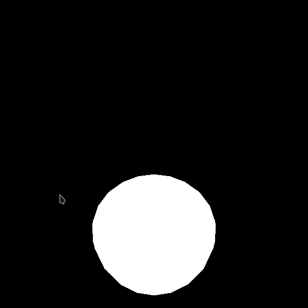

# Computação Gráfica Básica em C

Esse repositório contém alguns algoritmos clássicos de Computação Gráfica implementados em C. Esse projeto é parte da cadeira de Computação Gráfica da UFRPE (BCC, 2023.1). Especificamente, esse repositório contém uma pipeline de renderização simples baseada no *scanline* e o modelo de reflexão e tonalização de Phong. Para execução da pipeline, são necessários os arquivos que descrevem: (i) a câmera virtual; (ii) a malha do objeto 3D; e (iii) a iluminação da cena.

## Quickstart

Para testar a implementação, basta realizar o download do [executável mais recente](https://github.com/moesio-f/classic-cg/releases) compatível com seu sistema operacional (Windows ou Linux). Uma outra opção é compilar o projeto manualmente (necessário o SDL2, CMake e Make).

Uma vez realizado obtido o executável, podemos testar a pipeline de renderização da seguinte forma:

```console
# Executando em sistemas Linux-like
# ./render <path/to/camera.txt> </path/to/object.byu>
./render camera_1.txt maca2.byu

# Executando no Windows
# render.exe <path/to/camera.txt> </path/to/object.byu>
render.exe camera_1.txt maca2.byu
```

Ao executar as linhas acima, será produzido como resultado a seguinte visualização:



Podemos atualizar os arquivos de câmera (`.txt`) e de objeto (`.byu`) e apertar a tecla `R` para reexecutar o processo de renderização.

## Arquivo de descrição da Câmera

O arquivo de descrição da câmera possui os parâmetros da câmera virtual a serem utilizadas no processo de renderização. A tabela a seguir contém a descrição de cada um desses parâmetros.

| Parâmetro | Descrição |
| --- | --- |
| `C` | vetor (E3), representa o ponto de foco. | 
| `N` | vetor, base ortonormal do sistema. |
| `V` | vetor, base ortonormal do sistema. |
| `d` | escalar, define a distância do foco ao plano de vista. |
| `hx`| escalar, determina o retângulo de vista. |
| `hy`| escalar, determina o retângulo de vista. |


Um exemplo para esse arquivo é:

```
C = 0 -500 500
N = 0 1 -1
V = 0 -1 -1
d = 5
hx = 2
hy = 2
```

## Arquivo de descrição do Objeto

Esse é um arquivo que descreve a malha 3D do objeto a ser renderizado. Nele, são definidos todos os triângulos em coordenadas globais e como eles se conectam para formar o objeto. O formato desse arquivo é `.byu` e ele deve conter os seguintes dados:

```
<no de vértices> <no de triângulos>
<coordenada x do vértice 1> <coordenada y do vértice 1> <coordenada z do vértice 1>
<coordenada x do vértice 2> <coordenada y do vértice 2> <coordenada z do vértice 2>
...
<coordenada x do vértice n> <coordenada y do vértice n> <coordenada z do vértice n>
<índice do vértice 1 do triângulo 1> <índice do vértice 2 do triângulo 1> <índice do vértice 3 do triângulo 1>
<índice do vértice 1 do triângulo 2> <índice do vértice 2 do triângulo 2> <índice do vértice 3 do triângulo 2>
...
<índice do vértice 1 do triângulo k> <índice do vértice 2 do triângulo k> <índice do vértice 3 do triângulo k>
```

## Arquivo de descrição de Iluminação

TODO: adicionar em breve.

## Compilando o projeto

Também é possível realizar o clone do repositório e compilar o projeto (~15s) para geração do executável. Para realizar a compilação, é necessário:

- SDL2: https://wiki.archlinux.org/title/SDL;
- CMake (3.20+): https://cmake.org/;
- Make;

Uma vez que todas as dependências estejam instaladas, podemos fazer:

```console
git clone https://github.com/moesio-f/classic-cg/
cd classic-cg
make
./build/render data/camera/camera_1.txt data/objects/maca2.byu
```


